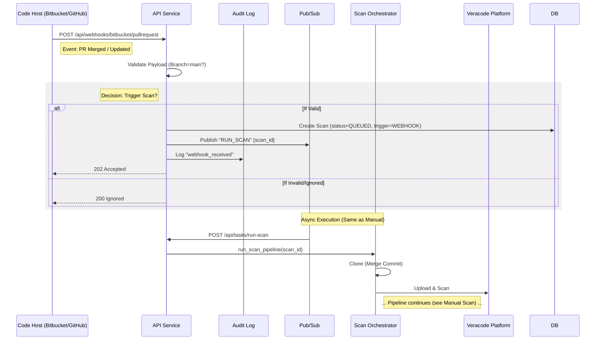

# Automated Scan Pipeline: Merge Event Flow

This document details the pipeline execution for an **Automated Scan** triggered by a code merge (e.g., Pull Request merge to `main`) in the CCV GCP-native architecture.

## 1. High-Level Overview

The automated pipeline allows for "Shift Left" security by automatically scanning code changes as they are merged.

1.  **Developer** merges a PR in the code host (Bitbucket/GitHub).
2.  **Code Host** sends a Webhook event to the API Service.
3.  **API Service** validates the event (e.g., branch rules).
4.  **API Service** triggers the scan process (similar to manual).
5.  **Orchestrator** performs the scan asynchronously.
6.  **Analysis Agent** processes findings and potentially comments back on the PR (future state).

---

## 2. Sequence Diagram

---

## 3. detailed Execution Flow

### Phase 1: Ingestion (`webhooks.py`)

*   **Endpoint**: `POST /api/webhooks/bitbucket/pullrequest`
*   **Payload**: specific JSON from the code host containing:
    *   `repository.full_name`
    *   `pullrequest.source.branch.name`
    *   `pullrequest.destination.branch.name` (Target)
    *   `pullrequest.state` (MERGED/OPEN)
*   **Action**:
    1.  **Parse**: Extract repo name, branch, and commit SHA.
    2.  **Filter**: Check if the target branch matches the policy (e.g., `main` or `develop`).
    3.  **Idempotency**: Check `audit_logs` to avoid duplicates if the webhook is retried.

### Phase 2: Trigger Logic

*   **Logic**:
    1.  **Repo Lookup**: Finds the internal `RepoDoc` matching the webhook's repository name (`repository.full_name`).
    2.  **Policy Check**: Confirms the target branch is `main` and a valid commit SHA exists.
    3.  **Scan Creation**: Creates a `ScanDoc` with `trigger_type=WEBHOOK`.
    4.  **Publish**: Calls `publish_run_scan(scan_id)` to invoke the async pipeline.
    5.  **Audit**: Logs the event and links the created `scan_id` for traceability.

### Phase 3: Execution (Standard Pipeline)

Once the `RUN_SCAN` message is published, the flow converges with the [Manual Scan Pipeline](./MANUAL_SCAN_PIPELINE.md).

*   **Diff Scan vs Full Scan**:
    *   Automated scans often use **Incremental/Sandboxes** in Veracode to speed up results.
    *   The `ScanDoc` can carry metadata (`scan_type="incremental"`) which the Orchestrator uses to decide whether to create a new sandbox or use the policy sandbox.

### Phase 4: Feedback Loop (Future)

*   After analysis is complete (Phase 6 of Manual Pipeline), the system can close the loop:
    *   **Pass/Fail**: Update the PR / Commit Status in Bitbucket/GitHub.
    *   **Comment**: Post AI-generated fix guidance directly on the PR lines.

## 4. Key Configuration

To enable this pipeline:

1.  **Env Vars**:
    *   `BITBUCKET_ENABLED=true`
    *   `BITBUCKET_WEBHOOK_SECRET=...` (for signature verification)
2.  **Repo Config**:
    *   Ensure the repository exists in the `repos` collection.

---

## 5. Summary of Differences (Manual vs Auto)

| Feature | Manual Scan | Automated Scan (Webhook) |
|---|---|---|
| **Trigger** | User (UI/API) | External System (Git Event) |
| **Context** | Specific Branch/Tag | Merge Commit / PR Branch |
| **Validation** | User Authorization | HMACC Signature / IP Allowlist |
| **Urgency** | High (User waiting) | Medium (CI/CD pipeline) |
| **Output** | UI Notification | UI + Commit Status / Chat Alert |
