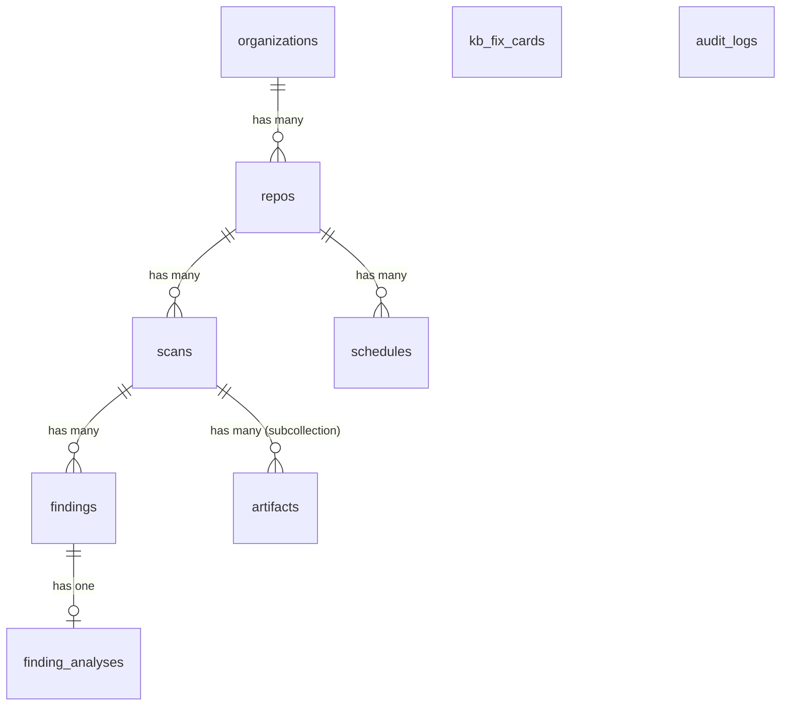

# CCV Data Model (GCP Native)

## 7 Core Collections · Firestore

The application uses Google Cloud Firestore (NoSQL) for all persistence.
Relational concepts are mapped to Collections and Subcollections.

---

## Collections Overview

| Collection | ID Format | Description |
|---|---|---|
| `repos` | UUID (str) | Git repositories |
| `scans` | UUID (str) | SAST scans (linked to repos) |
| `findings` | UUID (str) | Vulnerabilities found in scans |
| `finding_analyses` | UUID (str) | AI Analysis of findings (1-to-1) |
| `kb_fix_cards` | UUID (str) | Validated remediation guidance |
| `schedules` | UUID (str) | Periodic scan configs |
| `audit_logs` | UUID (str) | MCP tool usage logs |
| `sync_state` | "singleton" | Tracks Veracode polling state |

---

## ER Diagram (Conceptual)



---

## Schema Details

### 1. `repos` (Collection)

Stores repository metadata.

```json
{
  "id": "uuid-string",
  "org_id": "uuid-string",
  "name": "string",
  "default_branch": "main",
  "connected": true,
  "created_at": "timestamp",
  "updated_at": "timestamp"
}
```

### 2. `scans` (Collection)

Represents a targeted analysis of a repo.

```json
{
  "id": "uuid-string",
  "repo_id": "uuid-string",
  "branch": "main",
  "commit_sha": "abc1234",
  "trigger_type": "MANUAL|SCHEDULED|VERACODE_SYNC",
  "status": "QUEUED|RUNNING|COMPLETED|FAILED",
  "started_at": "timestamp",
  "finished_at": "timestamp",
  "error_message": null,
  "external_build_id": "veracode-build-123",
  "created_at": "timestamp"
}
```

#### `scans/{scan_id}/artifacts` (Subcollection)

Artifacts belonging to a specific scan.

```json
{
  "id": "uuid-string",
  "artifact_uri": "gs://bucket/path.zip",
  "artifact_sha256": "hash",
  "build_tool": "maven",
  "created_at": "timestamp"
}
```

### 3. `findings` (Collection)

Individual vulnerabilities or issues found during a scan.

```json
{
  "id": "uuid-string",
  "scan_id": "uuid-string",
  "cwe_id": 89,
  "severity": "High",
  "title": "SQL Injection",
  "file_path": "src/db.py",
  "line": 42,
  "fingerprint": "stable-hash-of-attributes",
  "raw_source_json": {},
  "code_snippet_json": { "snippet": "..." },
  "created_at": "timestamp"
}
```

### 4. `finding_analyses` (Collection)

AI-generated analysis for a specific finding.
ID matches the `id` of the document, but it also references `finding_id`.

```json
{
  "id": "uuid-string",
  "finding_id": "uuid-string",
  "model_name": "gemini-1.5-pro",
  "root_cause": "User input concatenated...",
  "risk": "Data exfiltration...",
  "fix_guidance": "Use parameterized queries...",
  "confidence": 0.95,
  "created_at": "timestamp"
}
```

### 5. `kb_fix_cards` (Collection)

Curated knowledge base of fixes.
**Note:** Vector embeddings are stored in Vertex AI Vector Search (not valid to store vector in Firestore directly for search, though we might store it for reference). The content is synced to Vertex AI.

```json
{
  "id": "uuid-string",
  "cwe_id": 89,
  "title": "Fixing SQL Injection",
  "tags": ["java", "sql"],
  "content": "Markdown content...",
  "content_hash": "sha256...",
  "approved": true,
  "created_at": "timestamp"
}
```

### 6. `schedules` (Collection)

Periodic scan configurations.

```json
{
  "id": "uuid-string",
  "repo_id": "uuid-string",
  "branch": "develop",
  "interval_minutes": 60,
  "enabled": true,
  "next_run_at": "timestamp",
  "created_at": "timestamp"
}
```

### 7. `audit_logs` (Collection)

Logs of MCP tool usage and privileged actions.

```json
{
  "id": "uuid-string",
  "request_id": "req-123",
  "actor": "user@example.com",
  "action": "veracode.upload_artifact",
  "param_summary": { "app_id": "123" },
  "created_at": "timestamp"
}
```

### 8. `sync_state` (Collection)

Stores singleton configuration or state.
Document ID: `veracode`

```json
{
  "last_synced_at": "timestamp",
  "last_seen_build_id": "12345"
}
```

---

## Indexes

Firestore requires composite indexes for complex queries.
See `firestore.indexes.json` (if applicable) or console.

Required Composite Indexes (Example):
- `findings`: `scan_id` ASC, `severity` DESC
- `scans`: `repo_id` ASC, `created_at` DESC
