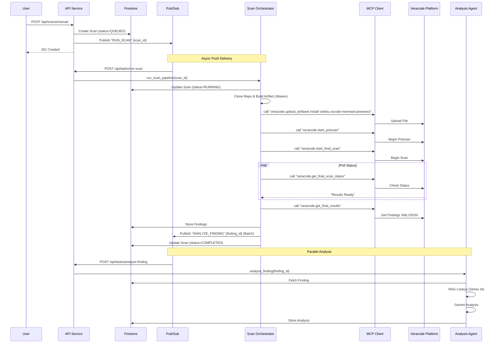

# Manual Scan Pipeline: Detailed Flow

This document explains the end-to-end execution pipeline of a **Manual Scan** in the CCV GCP-native architecture.

## 1. High-Level Overview

The manual scan process is **event-driven** and **asynchronous**.

1.  **User** triggers scan via UI/API.
2.  **API Service** creates a Scan record and publishes a `RUN_SCAN` event.
3.  **Pub/Sub** pushes the event back to the API Service's worker endpoint.
4.  **Orchestrator** executes the pipeline (Clone -> Build -> Upload -> Scan).
5.  **Veracode** processes the scan (external).
6.  **Orchestrator** polls for completion, fetches findings, and stores them.
7.  **Orchestrator** publishes `ANALYZE_FINDING` events for each vulnerability.
8.  **Analysis Agent** picks up findings, performs RAG + LLM analysis, and updates Firestore.

---

## 2. Sequence Diagram

---

## 3. Detailed Execution Flow

### Phase 1: Trigger (`scans_manual.py`)

*   **Endpoint:** `POST /api/scans/manual`
*   **Action:**
    1.  Creates a `ScanDoc` in Firestore with `status=QUEUED`.
    2.  Calls `publish_run_scan(scan_id)`.
    3.  Returns scan metadata to user immediately.

### Phase 2: Dispatch (`tasks.py`)

*   **Trigger:** Cloud Pub/Sub pushes message to `POST /api/tasks/run-scan`.
*   **Handler:** `handle_run_scan`
*   **Action:**
    1.  Decodes Pub/Sub envelope.
    2.  Extracts `scan_id`.
    3.  Invokes `scan_runner.orchestrator.run_scan_pipeline(scan_id)`.

### Phase 3: Orchestration (`orchestrator.py`)

The `run_scan_pipeline` function drives the linear workflow:

1.  **Preparation**:
    *   Fetches `ScanDoc` and linked `RepoDoc` from Firestore.
    *   Updates status to `RUNNING`.
2.  **Build**:
    *   `clone_repo()`: Clones git repository to local temp dir.
    *   `build_maven_project()`: Runs `mvn package` to generate JAR/WAR.
3.  **Upload (MCP)**:
    *   Calls `mcp.call_tool("veracode.upload_artifact")`.
    *   MCP Client uses `VeracodeClient` to upload the binary to Veracode.
4.  **Scanning (MCP)**:
    *   Calls `veracode.start_prescan`.
    *   Calls `veracode.start_final_scan`.
5.  **Polling**:
    *   Loops calling `veracode.get_final_scan_status` every N seconds.
    *   Waits until status is "Results Ready".

### Phase 4: Ingestion (`normalize.py`)

1.  **Fetch**: Calls `veracode.get_final_results` to get raw findings.
2.  **Normalize**: Converts Veracode JSON/XML into `FindingDoc` Pydantic models.
    *   Generates stable `fingerprint` for deduplication.
3.  **Store**: Batch writes `FindingDoc` objects to `findings` collection in Firestore.

### Phase 5: Analysis Trigger (`enqueue_analysis.py`)

*   Iterates through all new findings.
*   Publishes `ANALYZE_FINDING` messages to Pub/Sub for each finding.
*   This decouples ingestion from analysis, allowing parallel processing.

### Phase 6: AI Analysis (`agent.py`)

*   **Trigger:** Pub/Sub pushes to `POST /api/tasks/analyze-finding`.
*   **Handler:** `analysis_agent.agent.analyze_finding`.
*   **Steps:**
    1.  Fetches `FindingDoc` from Firestore.
    2.  **RAG Lookup**: Queries `KBFixCard` collection (via Vertex AI Vector Search) for similar past fixes.
    3.  **Prompt Generation**: Constructs prompt with:
        *   Finding details (CWE, code snippet).
        *   Retrieved Fix Cards (grounding).
        *   Security Expert Persona.
    4.  **LLM Call**: Invokes Vertex AI Gemini 1.5 Pro.
    5.  **Save**: parsing response and storing `FindingAnalysisDoc` in Firestore.

---

## 4. Key Components & Functions

| Component | File | Key Functions |
|---|---|---|
| **API Trigger** | `scans_manual.py` | `trigger_manual_scan` |
| **Pub/Sub Client** | `shared/pubsub_client.py` | `publish_run_scan` |
| **Task Handler** | `api_service/routes/tasks.py` | `handle_run_scan` |
| **Orchestrator** | `scan_runner/orchestrator.py` | `run_scan_pipeline` |
| **MCP Client** | `scan_runner/veracode_upload_api.py` | `call_tool` |
| **Normalizer** | `scan_runner/normalize.py` | `normalize_findings` |
| **Analysis Agent** | `analysis_agent/agent.py` | `analyze_finding` |

## 5. Intermediate Results

*   **Firestore `scans`**: Tracks progress (`QUEUED` -> `RUNNING` -> `COMPLETED`).
*   **Firestore `findings`**: Raw vulnerability data stored before analysis.
*   **Pub/Sub**: Acts as the buffer between stages, ensuring resilience if a worker fails.
*   **Logs**: `audit_logs` collection tracks every manual trigger and re-run.
