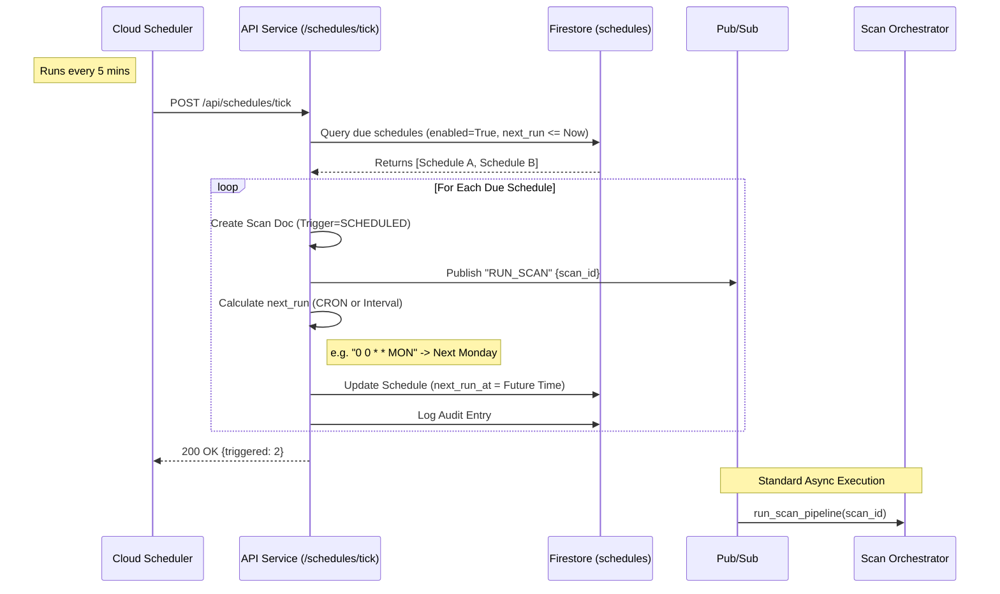

# Scheduled Scan Pipeline (CRON)

This document details the pipeline for **Scheduled Scans**, enabling automated security analysis on a recurring basis (Daily, Weekly, Monthly, etc.) using CRON expressions.

## 1. High-Level Overview

The scheduled pipeline is driven by a "Ticker" mechanism (Cloud Scheduler) that triggers the API to check for due jobs.

1.  **Cloud Scheduler** hits the API Tick Endpoint every 5 minutes.
2.  **API Service** queries Firestore for due schedules (`next_run_at <= now`).
3.  **API Service** triggers scans for all due items.
4.  **API Service** calculates the *new* `next_run_at` using the CRON expression and updates the schedule.
5.  **Scan Pipeline** executes as normal (see Manual Pipeline).

---

## 2. Sequence Diagram

---

## 3. Configuration & CRON Expressions

Schedules are defined with a `cron_expression` field. The system uses standard CRON syntax (5 fields):

`Minute Hour Day Month DayOfWeek`

### Common Examples

| Frequency | CRON Expression | Description |
|---|---|---|
| **Daily** | `0 0 * * *` | Run at midnight every day |
| **Weekdays** | `0 9 * * 1-5` | Run at 9 AM, Mon-Fri |
| **Weekly** | `0 0 * * 0` | Run at midnight on Sunday |
| **Monthly** | `0 0 1 * *` | Run at midnight on 1st of month |
| **Hourly** | `0 * * * *` | Run at start of every hour |

*Note: If `cron_expression` is not provided, the system falls back to `interval_minutes` (simple offset).*

## 4. Detailed Execution Flow

### Phase 1: The Tick (`schedules.py`)

*   **Endpoint**: `POST /api/schedules/tick`
*   **Logic**:
    1.  Fetches all enabled schedules where `next_run_at` is in the past.
    2.  Iterates through them.
    3.  **Error Handling**: If a CRON expression is invalid during runtime, the schedule is auto-disabled to prevent infinite error loops.

### Phase 2: Next Run Calculation

*   Uses the Python `croniter` library.
*   **Formula**: `next_run = croniter(expression, now).get_next()`
*   This ensures "drift" doesn't occur; it always snaps to the next valid CRON time.

### Phase 3: Execution

*   Once `RUN_SCAN` is published, the flow is identical to the [Manual Scan Pipeline](./MANUAL_SCAN_PIPELINE.md).
*   The `ScanDoc` will have `trigger_type="SCHEDULED"`, allowing for analytics on automated vs manual scans.
